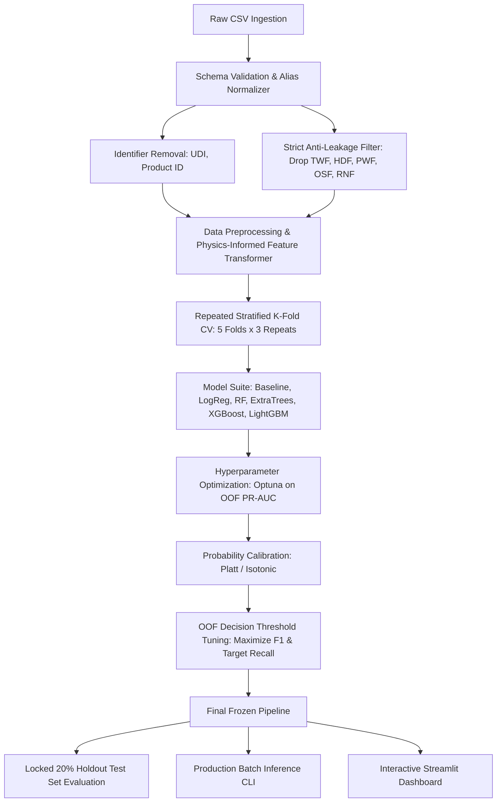

# PredictiveGuard ⚙️
### Industrial Predictive Maintenance Pipeline & Decision Support System
**ALGOTHON'26 Hackathon Submission**  
**Track:** ALG-DATA-02 — *"Predict What Happens Next"*  
**Domain:** Data Science & Machine Learning  

---

## 1. Project Title
**PredictiveGuard**: A Physics-Informed, Anti-Leakage Predictive Maintenance Architecture for Early Machine Failure Detection.

## 2. ALGOTHON'26 Problem Statement
**Track:** ALG-DATA-02 — *Predict What Happens Next*  
**Problem:** Historical sensory observations contain multi-physical precursors to industrial machine failure. The objective is to build a mathematically rigorous, reproducible, and robust predictive pipeline capable of anticipating equipment breakdown on unseen telemetry without overfitting or relying on data leakage.

## 3. Problem Definition
Predict whether an industrial machine will suffer a catastrophic breakdown (`Machine failure = 1`) given operating environment conditions, mechanical wear, rotational speed, and torque. 
- Highly imbalanced binary classification (~3.4% failure rate).
- Primary performance metric: **Precision-Recall AUC (PR-AUC / Average Precision)**.
- Secondary metrics: ROC-AUC, F1-Score, MCC, Precision, Recall.

## 4. Dataset
- **Name:** AI4I 2020 Predictive Maintenance Dataset
- **Size:** 10,000 operational observations
- **Target:** `Machine failure` (0 = Operational, 1 = Failure)
- **Features:** Machine Type (`L`, `M`, `H`), Air temperature [K], Process temperature [K], Rotational speed [rpm], Torque [Nm], Tool wear [min].
- **Failure Modes:** `TWF` (Tool Wear), `HDF` (Heat Dissipation), `PWF` (Power), `OSF` (Overstrain), `RNF` (Random).

## 5. Architecture
The system employs strict separation between feature extraction, data hygiene, and downstream modeling:



## 6. Data Pipeline
- Automated alias mapping (`air_temperature`, `airtemp`, etc. mapped to canonical names).
- Robust schema validation rejecting missing critical sensors while gracefully accepting arbitrary column order or extra irrelevant fields.
- Imputation and scaling integrated exclusively inside scikit-learn Pipelines.

## 7. Feature Engineering
Features are derived from the physical equations governing tool failure:
1. `temp_diff` = Process temperature - Air temperature [K] (Heat Dissipation Failure)
2. `power_w` = Torque × Rotational speed × 2π / 60 [Watts] (Power Failure)
3. `power_below_limit` = Deficit below 3500 W safe boundary
4. `power_above_limit` = Excess above 9000 W safe boundary
5. `power_distance_to_safe_band` = Distance from [3500 W, 9000 W] safe band
6. `wear_torque` = Tool wear × Torque [min·Nm] (Overstrain Failure)
7. `overstrain_ratio` = `wear_torque` / Type-specific capacity threshold (L: 11000, M: 12000, H: 13000)
8. `low_speed_low_tempdiff` = Non-linear interaction between temperature dissipation and RPM
9. `tool_wear_in_critical_band` & `tool_wear_critical_proximity` = Proximity to [200, 240] min tool wear limit
10. `speed_torque_ratio` = Rotational speed / Torque

## 8. Leakage Prevention
- Failure mode flags (`TWF`, `HDF`, `PWF`, `OSF`, `RNF`) describe the exact failure modes. Using them during inference is pure data leakage. They are stripped immediately upon ingestion and never enter the feature matrix.
- Preprocessing and feature engineering transformers are fit only on training splits during CV.
- Threshold tuning is conducted strictly on Out-Of-Fold (OOF) cross-validation predictions.
- The 20% hold-out test set remains locked until final evaluation.

## 9. Validation Strategy
- **Repeated Stratified K-Fold Cross-Validation** (5 folds × 3 repeats = 15 evaluation splits) to ensure low variance in estimated PR-AUC on imbalanced data.
- Comparison of random stratified split vs. temporal order preservation to account for potential random-walk telemetry characteristics.

## 10. Model Comparison
Baseline models evaluated across all folds:
- Stratified Dummy Classifier
- Balanced Logistic Regression (scaled)
- Balanced Random Forest
- Balanced Extra Trees
- XGBoost (tuned `scale_pos_weight`)
- LightGBM (tuned `class_weight='balanced'`)

## 11. Hyperparameter Tuning
- Bayesian optimization using Optuna (minimizing OOF PR-AUC loss).
- Strict cross-validation scoring without holdout contamination.

## 12. Mode-Aware Experiment
- Multi-head auxiliary model architecture predicting individual failure modes (`HDF`, `PWF`, `OSF`, `TWF`) from raw sensor features.
- Rigorous comparative analysis against single unified classifiers.

## 13. Calibration
- Reliability diagrams / calibration curves evaluated before and after Platt scaling and Isotonic regression.

## 14. Threshold Selection
- Threshold optimization based purely on OOF probability distributions.
- Operational trade-off analysis between False Negatives (unplanned catastrophic downtime) and False Positives (unnecessary maintenance inspections).

## 15. Final Results
*(To be populated in Phase 5 upon unlocking final holdout set)*

## 16. Robustness Testing
Evaluation of model resilience against:
- Gaussian sensor noise
- Random missing values (NaN injection)
- Environmental temperature shifts (+1K shifts)
- Distribution drift in RPM and Torque
- Unseen machine type categories
- Column reordering & extra irrelevant features

## 17. Explainability
- SHAP (SHapley Additive exPlanations) TreeExplainer summary plots and waterfall breakdowns.
- Physical attribution of failure modes.

## 18. Limitations
- `RNF` (Random Failure, ~0.1% base rate) is fundamentally unpredictable from sensor telemetry.
- Tool wear failure contains stochastic variance within the 200–240 minute range.

## 19. Reproducibility
Single global random seed (`RANDOM_SEED = 42`) seeded across `random`, `numpy`, and environment variables. Deterministic pipeline artifacts saved via `joblib`.

## 20. Running Locally

### Installation
```bash
# Clone repository and install dependencies
pip install -r requirements.txt
```

### CLI Pipeline Commands
```bash
# Run training pipeline with cross-validation
python -m src.train

# Run evaluation and generate reports
python -m src.evaluate

# Run batch inference on unseen CSV
python -m src.predict --input ai4i2020.csv --output predictions/predictions.csv

# Run test suite
pytest tests/ -v
```

### Makefile Support
```bash
make install
make train
make evaluate
make test
make predict
make app
```

## 21. Streamlit Demo
Launch the interactive industrial dashboard:
```bash
streamlit run app/streamlit_app.py
```

## 22. Testing
Test coverage includes schema validation, column aliases, anti-leakage guards, pipeline round-trip serialization, and physics calculations:
```bash
pytest tests/ -v
```

## 23. Future Improvements
- Multi-sensor vibration / frequency domain FFT feature integration.
- Remaining Useful Life (RUL) regression modeling.
- Online continuous learning from streaming telemetry.

## 24. Dataset Disclosure
AI4I 2020 Predictive Maintenance Dataset (UCI Machine Learning Repository / Matzka, S., 2020).

## 25. Libraries
`pandas`, `numpy`, `scikit-learn`, `xgboost`, `lightgbm`, `optuna`, `shap`, `matplotlib`, `seaborn`, `joblib`, `pytest`, `streamlit`.

## 26. AI-Assisted Development Disclosure
Developed in pair-programming collaboration with Google Antigravity AI following competitive machine learning best practices.
